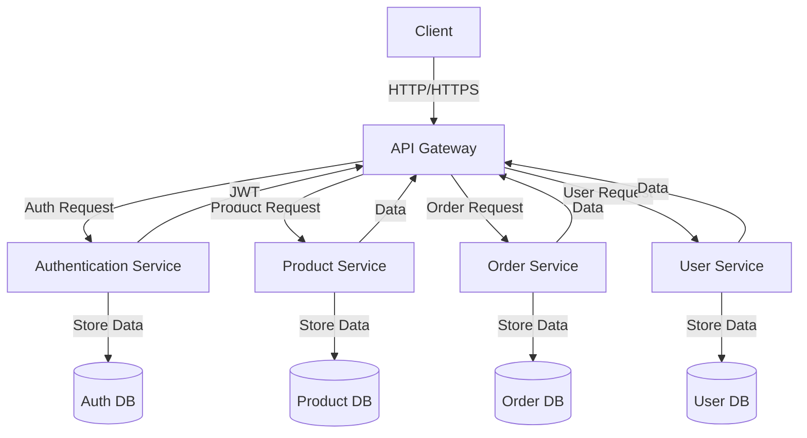
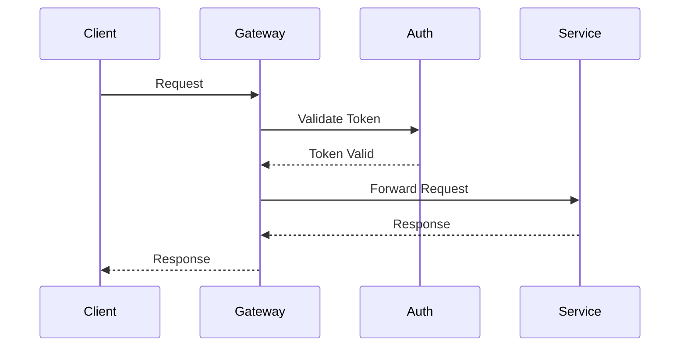
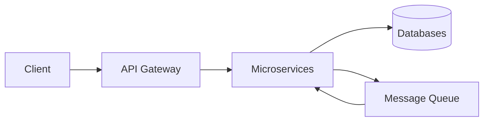

# Microservices Architecture Example

This project demonstrates a basic microservices architecture using Java Spring Boot. The architecture follows best practices for microservices design and includes proper service isolation, API Gateway pattern, and service discovery.

## Architecture Overview



## Service Components

1. **API Gateway**
   - Entry point for all client requests
   - Handles routing and request forwarding
   - Implements rate limiting and request validation
   - Built with Spring Cloud Gateway

2. **Authentication Service**
   - Handles user authentication and authorization
   - Manages JWT tokens
   - User session management
   - Built with Spring Security

3. **Product Service**
   - Manages product catalog
   - Handles product CRUD operations
   - Product search and filtering
   - Built with Spring Data JPA

4. **Order Service**
   - Processes orders
   - Manages order status
   - Handles payment integration
   - Built with Spring Boot

5. **User Service**
   - Manages user profiles
   - Handles user preferences
   - User data management
   - Built with Spring Boot

## Technology Stack

- **Backend**: Java 17, Spring Boot 3.x
- **API Gateway**: Spring Cloud Gateway
- **Service Discovery**: Eureka Server
- **Database**: MongoDB
- **Message Queue**: RabbitMQ
- **API Documentation**: SpringDoc OpenAPI
- **Containerization**: Docker
- **Build Tool**: Maven
- **Orchestration**: Docker Compose

## Project Structure

```
microservices-arch/
├── api-gateway/
├── auth-service/
├── product-service/
├── order-service/
├── user-service/
├── eureka-server/
├── pom.xml
├── docker-compose.yml
└── README.md
```

## Getting Started

1. Clone the repository
2. Install Java 17 and Maven
3. Build the project: `mvn clean install`
4. Run services using Docker Compose: `docker-compose up`

## API Documentation

Each service includes its own Swagger documentation accessible at:
- API Gateway: `http://localhost:8080/api-docs`
- Auth Service: `http://localhost:8081/api-docs`
- Product Service: `http://localhost:8082/api-docs`
- Order Service: `http://localhost:8083/api-docs`
- User Service: `http://localhost:8084/api-docs`

## Communication Flow



## Data Flow



## Security Considerations

1. Spring Security with JWT
2. Rate limiting with Spring Cloud Gateway
3. Input validation with Bean Validation
4. CORS configuration
5. Secure communication (HTTPS)
6. Data encryption

## Monitoring and Logging

- Centralized logging using ELK Stack
- Spring Boot Actuator for health checks
- Micrometer for metrics
- Distributed tracing with Spring Cloud Sleuth

## Deployment

The services can be deployed using Docker Compose or Kubernetes. Each service is containerized and can be scaled independently based on demand.

## Contributing

1. Fork the repository
2. Create a feature branch
3. Commit your changes
4. Push to the branch
5. Create a Pull Request 