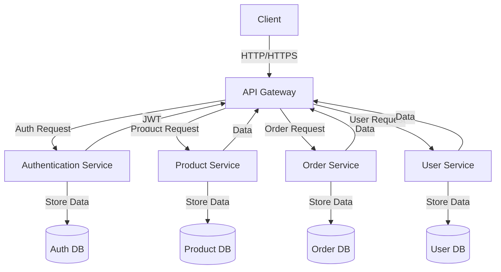
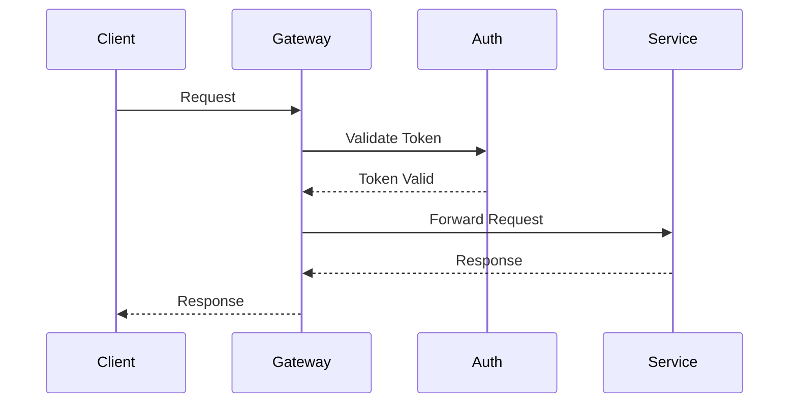
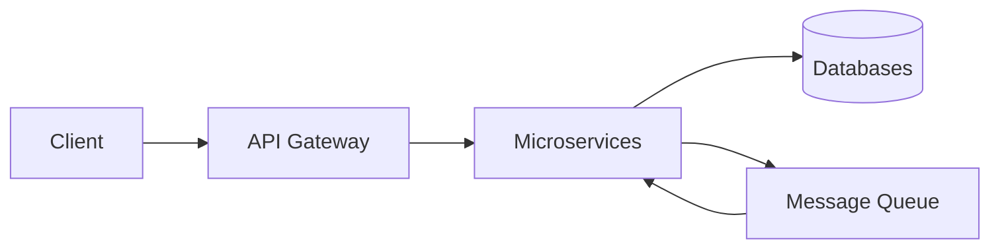

# Microservices Architecture Example

This project demonstrates a basic microservices architecture using Java Spring Boot. The architecture follows best practices for microservices design and includes proper service isolation, API Gateway pattern, and service discovery.

## Architecture Overview

## Communication Flow

## Data Flow

